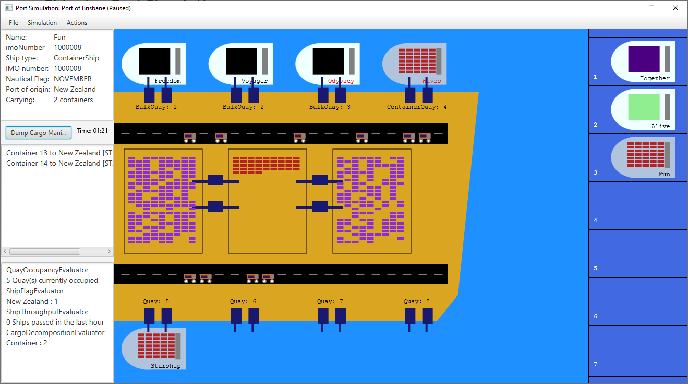

## CSSE2002 Shipping Port Simulation

Assignments 1 and 2 combined for UQ's [CSSE2002 Programming in the Large](https://my.uq.edu.au/programs-courses/course.html?course_code=CSSE2002) Semester 2, 2021




### Usage

Run [portsim.Launcher](src/portsim/Launcher.java) with VM options and the port file.

```
--module-path path/to/javafx/lib --add-modules javafx.controls 'saves/large.txt'
```


### Dependencies

- [Java 11](https://jdk.java.net/archive/ )
- [JavaFX 11](https://gluonhq.com/products/javafx/ )
- [JUnit 4](https://junit.org/junit4/)


### Acknowledgement

- All classes and methods marked with `@given` were supplied by the course staff.
- The majority of the JavaDoc was also supplied by the course staff.
