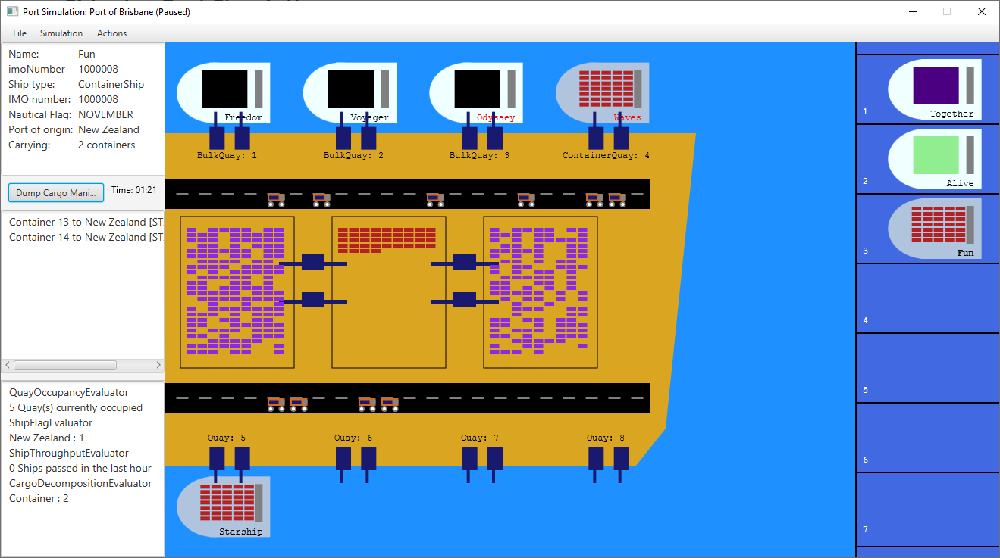

# CSSE2002 Shipping Port Simulation

Assignments 1 and 2 combined for [CSSE2002 Programming in the Large](https://my.uq.edu.au/programs-courses/course.html?course_code=CSSE2002) @ UQ Semester 2, 2021



## Usage

```shell
git clone https://github.com/JedWillick/portsim.git
cd portsim
./gradlew run --args='saves/large.txt'
```

## Dependencies

- [Java 11](https://jdk.java.net/archive/ )
- [JavaFX 11](https://gluonhq.com/products/javafx/ )
- [JUnit 4](https://junit.org/junit4/)

## Acknowledgement

- All classes and methods marked with `@given` were supplied by the course staff.
- The majority of the JavaDoc was also supplied by the course staff.
